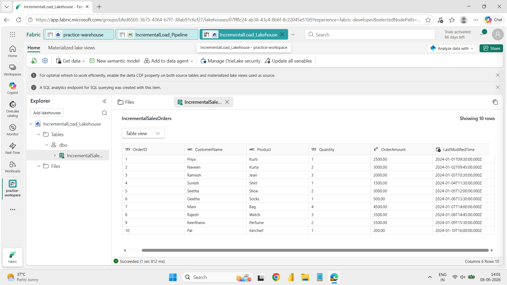
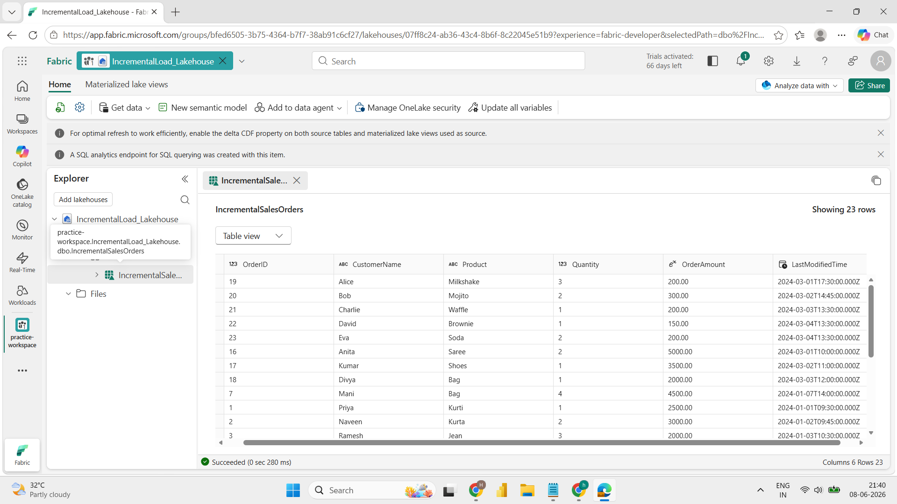
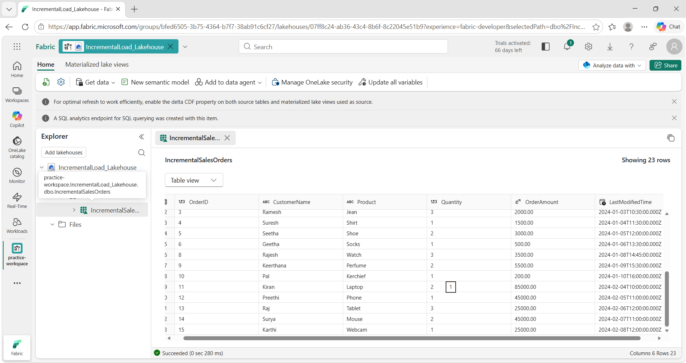
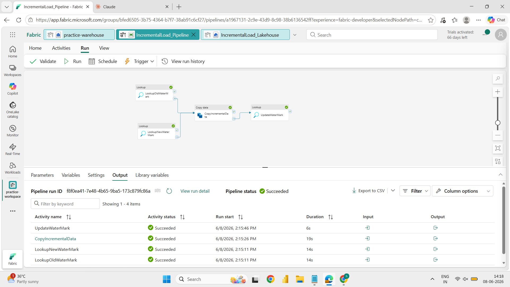

# Incremental Load Pipeline using Microsoft Fabric


## Project Overview

An end-to-end **Incremental Load pipeline** built on **Microsoft Fabric** that efficiently loads only new or changed records from a source table into a Lakehouse using a **Watermark-based strategy** and **Stored Procedures**.

This project demonstrates how to avoid full data reloads by tracking the last loaded timestamp, making pipelines faster, cost-effective, and production-ready.

---

## Architecture & Approach

```
Source Table (SQL)
      │
      ▼
Watermark Table  ──►  Fetch last loaded timestamp
      │
      ▼
Incremental Filter  ──►  Load only new/changed records
      │
      ▼
Lakehouse (Delta Table)
      │
      ▼
Update Watermark  ──►  Save new high-watermark timestamp
```

---

## Tech Stack

| Tool | Purpose |
|------|---------|
| Microsoft Fabric | Cloud data platform |
| SQL (Stored Procedure) | Incremental logic & watermark update |
| Delta Tables / Lakehouse | Destination storage |
| Pipeline Automation | Orchestration & scheduling |

---

## Files

| File | Description |
|------|-------------|
| `Source_table.sql` | Script to create and populate the source table |
| `WaterMarkTable.sql` | Script to create the watermark tracking table |
| `StoredProcedure.sql` | Stored procedure to update watermark after each load |
| `Pipeline Configuration` | Screenshot of the Fabric pipeline setup |
| `screenshots/` | Before and after Lakehouse screenshots |

---

## How It Works

1. **Source Table** is created with timestamped records to simulate new/updated data.
2. **Watermark Table** stores the last successfully loaded timestamp.
3. **Pipeline** reads the current watermark, fetches only records newer than that timestamp from the source.
4. **New records** are loaded into the Lakehouse as Delta Tables.
5. **Stored Procedure** updates the watermark to the latest timestamp after a successful load.
6. On the next run, only records added after the previous load are picked up — no duplicates, no full reloads.

---

## Screenshots

### Lakehouse — Before Incremental Load


### Lakehouse — After Incremental Load (Run 1 & Run 2)



### Pipeline Configuration


---

## Key Concepts Demonstrated

- ✅ Watermark-based incremental loading strategy
- ✅ Stored procedure for automated watermark updates
- ✅ Delta Table storage in Microsoft Fabric Lakehouse
- ✅ Pipeline orchestration with trigger-based execution
- ✅ Avoiding redundant full loads — optimised for scale

---

## Related Project

Check out my end-to-end Medallion Architecture project:  
🔗 [fabric-medallion-sales-analytics](https://github.com/HARINI-mp13/fabric-medallion-sales-analytics)

## Author

**Harini**   
